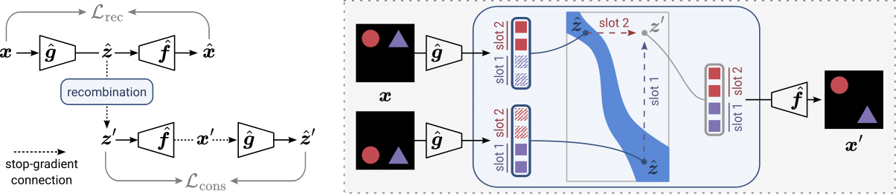

# Provable Compositional Generalization for Object-Centric Learning [ICLR 2024]
Official code for the paper [Provable Compositional Generalization for Object-Centric Learning](https://arxiv.org/abs/2310.05327).



## Environment Setup
This code was tested with Python 3.10. Start by cloning the repository:

```bash
git clone https://github.com/your-repository-url-here
cd your-repository-directory
```

Then, set up your environment by choosing one of the following methods:

<details open>
<summary><strong>Option 1: Installing Dependencies Directly</strong></summary>

   ```bash
   pip install -r requirements.txt
   ```

</details>
Or, alternatively, you can use Docker:

<details open>
<summary><strong>Option 2: Building a Docker Image</strong></summary>

Build and run a Docker container using the provided Dockerfile:
   ```bash
   docker build -t your-docker-image-name .
   docker-compose up
   ```

</details>

## Data Generation

## Training and Evaluation
